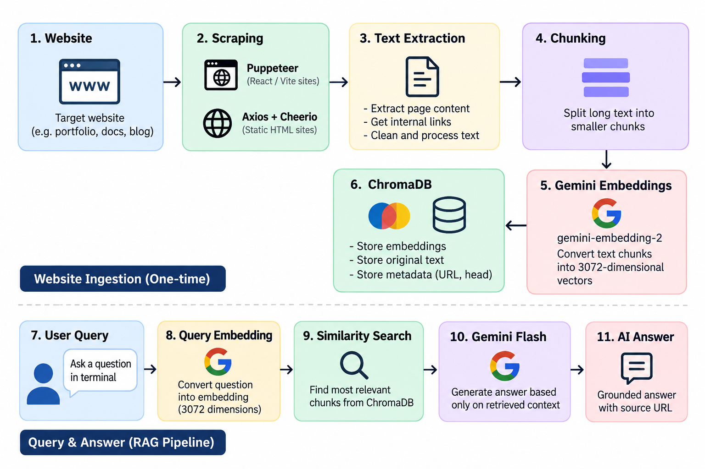

# 🤖 RAG Web Support Agent

An AI-powered Website Support Agent that crawls websites, builds a vector knowledge base using Gemini Embeddings + ChromaDB, and answers user questions through a complete Retrieval-Augmented Generation (RAG) pipeline.

> Built from scratch with Node.js, Puppeteer, Gemini, and ChromaDB.

---

## Demo

Coming soon....


---

## Features

- 🌐 Scrape static websites with Axios + Cheerio
- ⚛️ Scrape React/Vite websites using Puppeteer
- ✂️ Automatic text chunking for long pages
- 🧠 Gemini Embedding API (3072-dimensional vectors)
- 📚 ChromaDB vector database
- 🔍 Semantic similarity search (RAG)
- 💬 Interactive terminal chatbot
- 🔗 Returns answers grounded in website content

---

## Architecture

 

### RAG Pipeline

Website
→ Scraping (Puppeteer / Axios)
→ Text Extraction
→ Chunking
→ Gemini Embeddings
→ ChromaDB
→ Similarity Search
→ Gemini Flash
→ AI Answer

---

## Tech Stack

| Category | Technology |
|----------|------------|
| Runtime | Node.js |
| Language | JavaScript |
| Scraping | Puppeteer, Axios, Cheerio |
| AI | Google Gemini |
| Vector DB | ChromaDB |
| CLI | readline-sync |

---

## How it works

### 1. Crawl website

The agent extracts visible text and internal links.

### 2. Chunk content

Large webpages are divided into semantic chunks for better retrieval.

### 3. Create embeddings

Each chunk is converted into a **3072-dimensional vector** using `gemini-embedding-2`.

### 4. Store vectors

Embeddings, original text, and metadata are stored inside ChromaDB.

### 5. Ask questions

User questions are embedded and matched against the nearest vectors before Gemini generates the final answer.

---

## Installation

```bash
git clone https://github.com/AmannRawat/RAG-WebSupport-Agent.git

cd RAG-WebSupport-Agent

npm install
```

Create a `.env` file:

```env
GEMINI_API_KEY=your_api_key_here
```

Start ChromaDB:

```bash
docker compose up -d
```

Run the project:

```bash
node index.js
```

## Project Structure

```text
.
├── index.js
├── docker-compose.yml
├── package.json
├── .env.example
└── README.md
```

---

## Challenges Solved

- React websites don't expose rendered content → solved with Puppeteer
- Long webpages exceed embedding limits → implemented chunking
- Duplicate crawling → normalized URLs + visited set
- Grounded AI responses → semantic retrieval with ChromaDB

---

## Future Improvements

- MERN Web UI
- Streaming responses
- Incremental indexing
- Persistent vector collections
- Source citations with multiple retrieved chunks

---

## Author

**Aman Rawat**

- GitHub: https://github.com/AmannRawat
- LinkedIn: www.linkedin.com/in/amanrwtt
